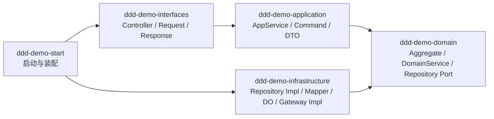
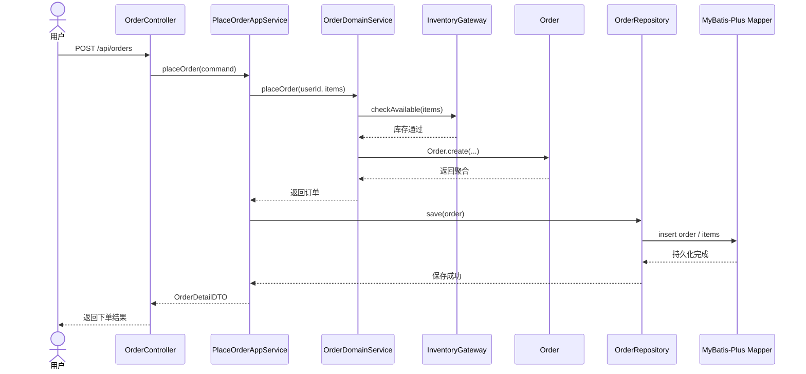
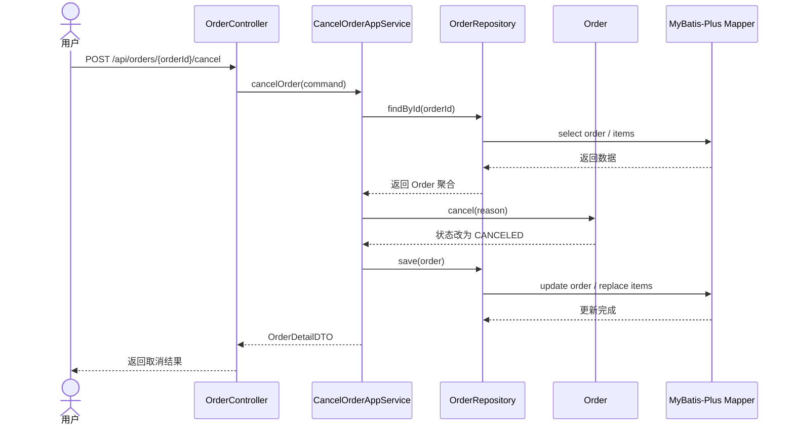

# DDD Demo

一个用于学习 DDD 的教学型项目，技术栈固定为：

- Spring Boot 2.7
- JDK 8
- MyBatis-Plus
- Maven 多模块单体

这个项目不是为了展示“功能很多”，而是为了让你顺着代码一眼看懂：

1. DDD 分层分别负责什么
2. 业务规则应该写在什么地方
3. MyBatis-Plus 在 DDD 项目里应该放在哪一层

## 业务场景

项目只保留两个强相关用例：

1. 下单
2. 取消订单

这样能把注意力集中在订单聚合、库存校验、仓储抽象、应用服务编排这些核心概念上。

## 模块说明

### `ddd-demo-domain`

领域层，只关心业务模型和业务规则：

- 聚合根：`Order`
- 聚合内实体：`OrderItem`
- 值对象：`OrderId`、`Money`、`UserId`、`ProductId`
- 领域服务：`OrderDomainService`
- 仓储接口：`OrderRepository`
- 外部能力抽象：`InventoryGateway`

这一层不依赖 Spring MVC，也不依赖 MyBatis-Plus。

### `ddd-demo-application`

应用层，只负责用例编排：

- 接收命令对象
- 调用领域模型
- 处理事务边界
- 将领域对象转换为 DTO

你可以把它理解为“业务用例入口”，但它不应该承载核心业务规则。

### `ddd-demo-infrastructure`

基础设施层，负责技术细节落地：

- MyBatis-Plus `Mapper`
- 数据库 DO
- 仓储实现
- 伪库存网关
- 数据库配置

这一层回答的是“怎么存”“怎么接外部系统”，不是“业务应该怎么做”。

### `ddd-demo-interfaces`

接口层，负责对外暴露 HTTP 接口：

- `Controller`
- 请求/响应对象
- 参数校验
- 统一异常处理

### `ddd-demo-start`

启动模块，负责启动 Spring Boot。

## 建议阅读顺序

如果你是第一次看 DDD，建议按这个顺序看：

1. `README.md`
2. `docs/how-to-read-ddd-demo.md`
3. `ddd-demo-domain` 下的 `Order`
4. `ddd-demo-application` 下的 `PlaceOrderAppService`
5. `ddd-demo-infrastructure` 下的 `MybatisPlusOrderRepository`
6. `ddd-demo-interfaces` 下的 `OrderController`

## 一条典型调用链

下单接口调用链如下：

`Controller -> AppService -> DomainService -> Aggregate -> Repository -> MyBatis-Plus`

其中：

- Controller 负责接收 HTTP 请求
- AppService 负责组织一次完整用例
- DomainService 负责协调需要外部能力参与的领域逻辑
- Aggregate 负责守住自身业务规则
- Repository 负责用业务语言读写聚合
- MyBatis-Plus 只是一种持久化实现细节

## DDD 分层结构图

先把这个项目当成两套关系一起看：

1. 编译期模块依赖关系
2. 运行期业务调用链

### 1. 编译期模块依赖关系



这个图最重要的点是：

- `domain` 在依赖方向上位于最内层
- `application` 依赖 `domain`
- `interfaces` 不直接依赖 `infrastructure`
- `infrastructure` 依赖 `domain`，因为它要去实现领域层定义的仓储接口和外部能力接口

### 2. 运行期下单调用链



这个时序图表达的是 DDD 最常见的一层意思：

- 接口层只接 HTTP，不直接写业务规则
- 应用层只编排用例，不直接写数据库细节
- 领域层负责真正的业务决策
- 基础设施层只负责把领域对象存进去或接外部能力

### 3. 运行期取消订单调用链



这条链路最值得注意的点不是“取消了订单”，而是：

- 先取回聚合
- 再调用聚合行为
- 最后整体保存

这和传统三层里常见的 `update status by id` 是两种思路。这里强调的是“让业务对象自己维护规则”。

## 为什么库存不单独拆成一个完整子系统

这是一个教学示例，不是企业全量项目。

如果把库存也完整建模成第二个限界上下文，你第一次看 DDD 时很容易把注意力消耗在“系统协作”上，而不是“聚合和分层”上。因此这里把库存收敛成一个外部能力接口 `InventoryGateway`，由基础设施层给一个伪实现。

## 数据库说明

项目已经提供 MySQL 风格的示例配置，但默认不要求真实连接成功。你可以把它当成一个结构完整、代码可读的模板项目。

示例 DDL 见：`docs/sql/demo-ddl.sql`

## 运行方式

```bash
mvn test
mvn -pl ddd-demo-start spring-boot:run
```

如果你本地没有数据库，也可以只看代码和测试。

## 接口示例

### 1. 下单

```http
POST /api/orders
Content-Type: application/json

{
  "userId": 1001,
  "items": [
    {
      "productId": 2001,
      "productName": "DDD 实战课程",
      "quantity": 2,
      "salePrice": 199.00
    }
  ]
}
```

### 2. 取消订单

```http
POST /api/orders/{orderId}/cancel
Content-Type: application/json

{
  "reason": "用户主动取消"
}
```

### 3. 查询订单详情

```http
GET /api/orders/{orderId}
```

## 这个项目刻意保留的 DDD 教学点

- `Order` 聚合根不暴露任意 setter
- 取消订单不是直接 update 状态，而是调用 `order.cancel(reason)`
- 应用层不直接写 Mapper
- 仓储接口定义在领域层，实现放在基础设施层
- MyBatis-Plus 只服务持久化，不主导领域模型

## 你可以继续怎么扩展

看懂这个项目后，比较自然的下一步是：

1. 加入支付成功回调，观察订单状态如何演进
2. 把库存拆成独立限界上下文
3. 加入领域事件，理解最终一致性
4. 为查询侧单独做读模型，理解 CQRS 的必要性
