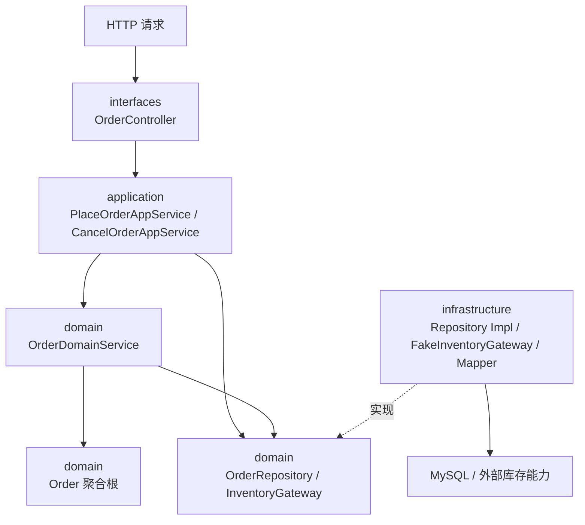
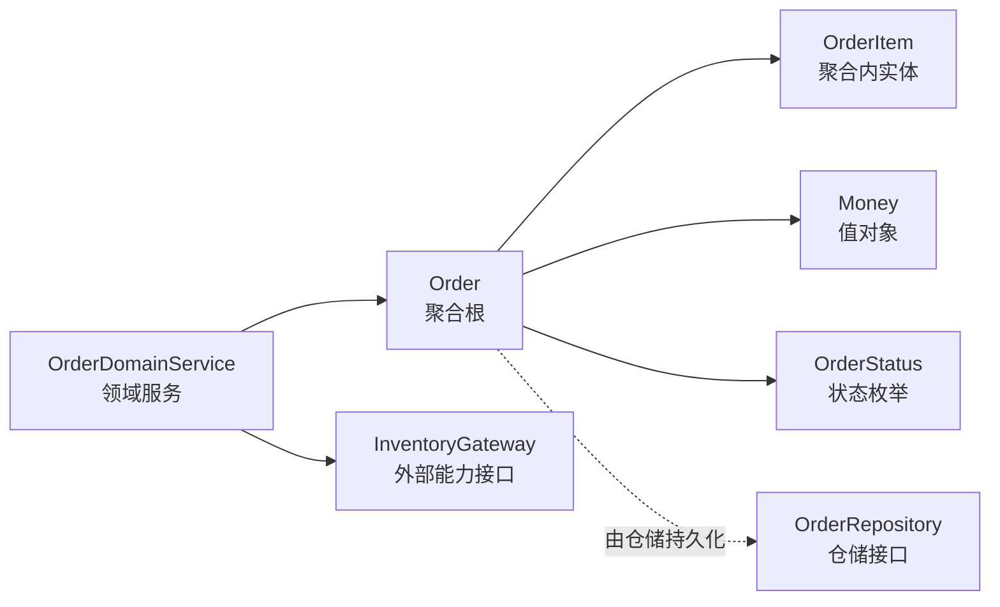
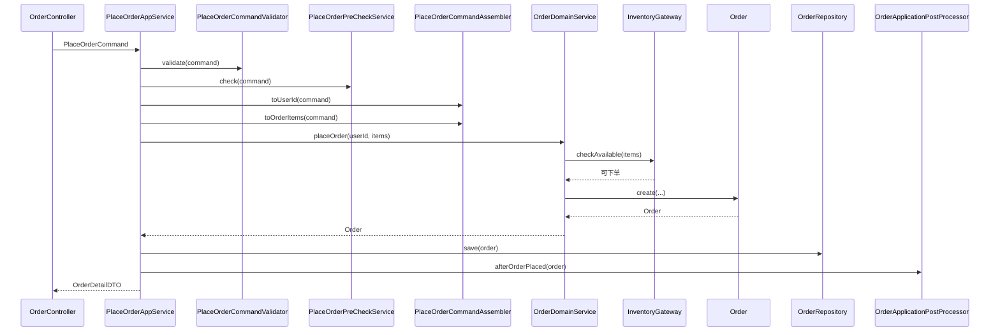
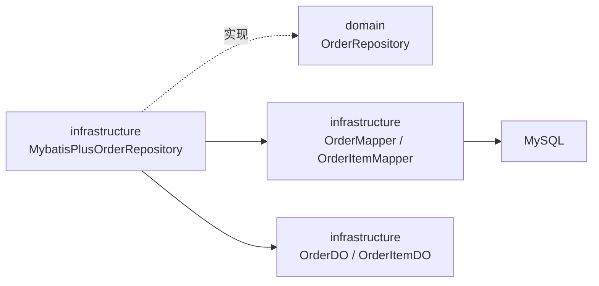
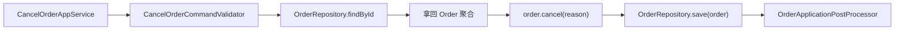

# 如何阅读这个 DDD Demo

如果你以前看过很多“DDD 示例”，却还是没搞清楚为什么要这么分层，可以按下面的顺序看。

## 先用一张图建立全局感

开始读代码前，先记住这张图：

读这张图时只抓一件事：

> 业务规则在中间，技术细节在外面。

如果你在阅读过程中一直能守住这句话，这个项目就不会被你看成“只是换了包名的三层架构”。

## 第一步：先看领域层

先看 `ddd-demo-domain`。

重点文件：

- `Order`
- `OrderItem`
- `Money`
- `OrderDomainService`
- `OrderRepository`
- `InventoryGateway`

你要先建立一个观念：

> DDD 不是先想数据库表怎么建，而是先想“业务对象自己应该知道什么、保证什么规则”。

### 看 `Order` 时重点看什么

1. 为什么没有公开 setter
2. 为什么取消订单要调用 `cancel(reason)`，而不是直接改状态
3. 为什么总金额由聚合内部统一计算

如果这三点你看懂了，说明你已经抓到 DDD 的第一层意思了。

### 领域层内部关系图

这张图的重点是：

- `Order` 是真正的核心
- `OrderItem` 不是独立聚合，而是 `Order` 的一部分
- `OrderRepository` 和 `InventoryGateway` 都只是领域看到的抽象，不是具体技术实现

## 第二步：看应用层怎么编排用例

再看 `ddd-demo-application`。

重点文件：

- `PlaceOrderAppService`
- `CancelOrderAppService`
- `GetOrderDetailAppService`
- `PlaceOrderCommandValidator`
- `CancelOrderCommandValidator`
- `PlaceOrderCommandAssembler`
- `PlaceOrderPreCheckService`
- `OrderApplicationPostProcessor`

这里你会看到一个典型区别：

- 领域层负责“规则”
- 应用层负责“流程”

例如下单流程里，应用层会做：

1. 接收命令
2. 做用例入口校验
3. 做 application 前置检查
4. 把命令转换成领域对象
5. 调用领域服务
6. 保存聚合
7. 执行 application 后处理
8. 返回 DTO

但“订单项不能为空”“只能取消已创建订单”这类规则，不应该散落在应用层里。

### 为什么 application 层要再拆一点

这个项目刻意把 application 层再拆成几种角色，目的是让“编排”更容易看出来：

- `Validator`
说明：负责用例入口校验，比如命令不能为空、订单项不能为空。

- `PreCheckService`
说明：负责 application 级前置检查，比如用户是否允许发起这次用例。

- `CommandAssembler`
说明：负责把命令对象转换成领域对象，比如 `UserId`、`OrderItem`。

- `PostProcessor`
说明：负责在保存之后串联应用层动作，比如操作日志和应用事件。

- `AppService`
说明：负责把这些步骤串起来，再调用领域服务和仓储。

这样拆的重点不是“类越多越高级”，而是为了让你明确看到：

- 输入校验不一定等于领域规则
- application 的前置检查不一定等于领域规则
- 命令到领域对象的转换是 application 职责
- 日志、事件这类后处理也经常是 application 职责
- 真正的业务决策仍然在 domain

### 下单用例链路图

你可以把这条链理解成一句话：

> 应用层组织动作，领域层做业务决定，仓储层负责落库，后处理继续留在应用层。

## 第三步：看仓储接口和仓储实现如何分开

接着对照看：

- `ddd-demo-domain` 中的 `OrderRepository`
- `ddd-demo-infrastructure` 中的 `MybatisPlusOrderRepository`

这是 DDD 落地里非常关键的一点：

- 领域层定义“我需要一个仓储”
- 基础设施层负责“我用 MyBatis-Plus 来实现这个仓储”

这意味着业务模型不需要关心底层到底是 MyBatis、JPA，还是别的存储方式。

### 仓储落位图

这张图在帮你回答一个很常见的问题：

> 为什么仓储接口放在领域层，而实现放在基础设施层？

因为领域层表达的是“我要什么能力”，基础设施层表达的是“我用什么技术实现这个能力”。

## 第四步：最后再看 Controller

Controller 只负责把 HTTP 请求转成命令对象，然后调用 AppService。

如果你在 Controller 里看到：

- 直接写 SQL
- 直接写 Mapper
- 直接拼装复杂业务规则

那基本就不是这个示例想表达的 DDD 结构了。

## 取消订单为什么更能看出 DDD

很多人第一次看不懂 DDD，是因为“创建”场景和普通三层看起来都像在 new 对象再保存。

真正能拉开差异的，往往是“状态变化”场景，比如取消订单：

这背后的意图是：

1. 不是直接按 ID 改字段
2. 而是把业务对象先拿回来
3. 由业务对象自己判断能不能取消
4. 再把结果保存回去
5. 保存后继续执行 application 层后处理

如果你把这个过程看懂了，就能理解为什么 DDD 强调聚合行为，而不是只强调数据结构。

## 一张职责对照表

| 层 | 代表类 | 应该做什么 | 不应该做什么 |
| --- | --- | --- | --- |
| interfaces | `OrderController` | 接 HTTP、做参数转换、返回响应 | 写核心业务规则、直接调 Mapper |
| application | `PlaceOrderAppService` | 编排用例、控制事务、返回 DTO | 持有复杂业务规则、拼 SQL |
| domain | `Order` / `OrderDomainService` | 表达模型、约束规则、定义仓储口 | 依赖 MyBatis-Plus、依赖 Web |
| infrastructure | `MybatisPlusOrderRepository` | 实现仓储、DO 转换、访问数据库 | 定义业务规则、主导领域模型 |

## 这个项目有意“没有做满”的地方

为了保证你第一次读时不被复杂度压住，这个项目刻意没有展开：

- 支付成功回调
- 领域事件
- CQRS
- 多限界上下文协作
- 分布式事务

这些都很重要，但不适合放在“第一眼看懂 DDD”这个目标里。

## 读完后你应该能回答 5 个问题

1. 聚合根为什么不能随便暴露 setter
2. 为什么取消订单应该是一个领域行为，而不是一个状态字段修改
3. 为什么 MyBatis-Plus 不应该直接出现在领域层
4. 为什么应用层和领域层不能混写
5. 为什么仓储接口定义在领域层，实现放在基础设施层

如果你能把这 5 个问题讲清楚，这个项目的目标就达到了。
