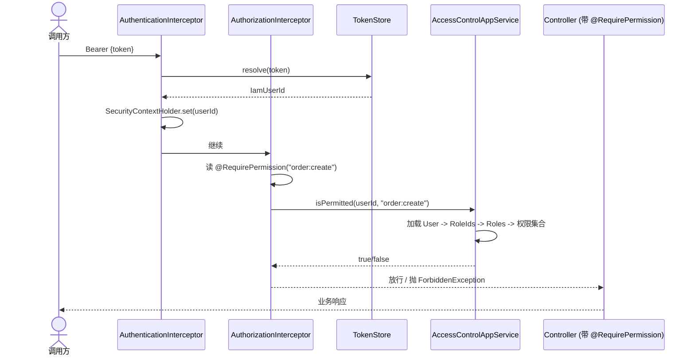

# IAM 领域：登录鉴权与 RBAC

本文档说明项目里第三个限界上下文 `iam`：负责用户身份认证、会话 Token、基于角色的访问控制（RBAC）。

它和 `order`、`membership` 在领域层面完全独立，不互相依赖。接口层通过两个 `HandlerInterceptor` 把鉴权能力以横切方式接入所有受保护的 HTTP 接口。

## 模型一览

```
User (聚合根)
  - IamUserId
  - Username (值对象，正则约束)
  - HashedPassword (值对象，hash + salt)
  - UserStatus (ACTIVE / DISABLED)
  - Set<RoleId>

Role (聚合根)
  - RoleId
  - RoleCode (值对象，大写字母数字下划线)
  - name
  - Set<PermissionCode>

PermissionCode (值对象)
  - 形如 resource:action，例如 order:create
  - 支持通配符 *，例如 order:* 含义为对 order 资源拥有任意动作
```

## 关键设计约束

1. `User` 不持有 `Role` 整体，只持有 `RoleId` 集合。两个聚合通过 ID 关联，由应用层组装。
2. `PermissionCode` 自带 `implies(required)`，权限校验是“拥有的权限是否覆盖所需权限”，不是字符串相等。
3. 密码以 hash + salt 形式存储，领域层只看到 `HashedPassword`，明文密码只出现在应用层入口的 `Command` 和领域服务 `IamLoginService` 内。
4. Token 通过 `TokenStore` 端口抽象，默认实现是进程内 `InMemoryTokenStore`，可以替换为 Redis 或 JWT 实现。

## 模块落位

```
ddd-demo-domain
  com.example.ddd.domain.iam
    model/        User, Role, 值对象, 枚举
    repository/   UserRepository, RoleRepository
    gateway/      PasswordEncoder
    service/      IamLoginService, IamAuthorizationService

ddd-demo-application
  com.example.ddd.application.iam
    command/      LoginCommand, CreateUserCommand, CreateRoleCommand, ...
    dto/          LoginResultDTO, CurrentUserDTO, UserDetailDTO, RoleDetailDTO
    assembler/    IamDtoAssembler
    port/         TokenStore
    service/      LoginAppService, UserAppService, RoleAppService, AccessControlAppService

ddd-demo-infrastructure
  com.example.ddd.infrastructure.iam
    dataobject/   UserDO, RoleDO
    mapper/       UserMapper, RoleMapper
    assembler/    UserDataAssembler, RoleDataAssembler
    repository/   MybatisPlusUserRepository, MybatisPlusRoleRepository
    gateway/      Sha256PasswordEncoder, InMemoryTokenStore
    IamBeanConfiguration

ddd-demo-interfaces
  com.example.ddd.interfaces.iam
    security/     RequirePermission, SecurityContextHolder,
                  AuthenticationInterceptor, AuthorizationInterceptor,
                  UnauthorizedException, ForbiddenException
    config/       IamWebMvcConfiguration
    request/      LoginRequest, CreateUserRequest, ...
    controller/   AuthController, IamUserController, IamRoleController
```

## 一次受保护请求的调用链



## 用法

### 1. 在 Controller 方法上声明权限

```java
@PostMapping
@RequirePermission("order:create")
public ApiResponse<OrderDetailDTO> placeOrder(@Valid @RequestBody PlaceOrderRequest request) {
    ...
}
```

注解可以打在方法上也可以打在类上，方法注解优先级更高。

### 2. 登录

```http
POST /api/auth/login
Content-Type: application/json

{ "username": "alice", "password": "secret123" }
```

返回：

```json
{ "success": true, "data": { "token": "...", "userId": ..., "username": "alice" } }
```

### 3. 后续请求

```http
GET /api/auth/me
Authorization: Bearer {token}
```

未带 Token 返回 401，权限不足返回 403。

### 4. 角色和授权

```http
POST /api/iam/roles
{ "code": "ADMIN", "name": "管理员" }

POST /api/iam/roles/{roleId}/permissions
{ "permissionCode": "order:*" }

POST /api/iam/users/{userId}/roles
{ "roleId": ... }
```

## 权限命名约定：权限、资源与领域的关系

很多人第一次看 RBAC 会以为"一个权限 name 就对应一个领域"。其实不是——权限的粒度和领域边界是两件事。

### 三层概念

```
限界上下文 (Bounded Context)     →  领域边界，关注一致性和自治
  └─ 资源 (Resource)             →  被保护的业务对象
       └─ 操作 (Action)          →  能对该资源做什么
```

一个权限 code 格式为 `resource:action`。**resource 不等于 domain**——它只是"需要被保护的一类业务对象"。

### 对照本项目

| 领域 | 权限 code | 资源 | 操作 |
|---|---|---|---|
| Order | `order:create` | 订单 | 创建 |
| Order | `order:cancel` | 订单 | 取消 |
| Order | `order:read` | 订单 | 查看 |
| Membership | `membership:register` | 会员 | 注册 |
| Membership | `points:earn` | 积分 | 赚取 |
| Membership | `points:consume` | 积分 | 消费 |
| IAM | `iam:user:create` | IAM 用户 | 创建 |
| IAM | `iam:role:grant` | IAM 角色 | 授权 |

几个关键观察：

1. **同一领域可以有多个 resource**：Order 领域日后加退款，就会多一个 `refund:apply` / `refund:approve`，它和 `order:create` 在同一领域但不同资源。
2. **IAM 用三段式 `domain:resource:action`**：因为 IAM 内部资源较多（user、role），两段不够区分。这是命名约定，不是框架强制。
3. **通配符跨操作不跨资源**：`order:*` 表示对"订单"资源可以做任意操作，但不覆盖 `refund:*`。

### 该怎么选择粒度

**resource 怎么切：** 看业务上是否会"分人管理"。订单和退款常分两个岗位，那就分开；订单和订单项一般同一个人管，不需要为订单项单独建权限。

**action 怎么切：** 看是否有"只读 vs 写 vs 危险操作"的区分。`order:read` 跟 `order:cancel` 一定要分——一个是客服查单，一个是运营操作。如果两个操作永远由同一角色执行、你想不出需要拆开的场景，就不拆。

### 跟 DDD 的对应关系

| 你在 DDD 里关心的 | 在权限体系里对应什么 |
|---|---|
| 限界上下文 | 权限 code 的第一段可以按上下文前缀分组（如 `iam:`），但不强制 |
| 聚合根 | 通常是一个 resource |
| 聚合行为（如 `order.cancel()`） | 通常是一个 action |
| 聚合内实体（如 `OrderItem`） | 大部分时候不需要独立权限，跟着聚合根走 |

一句话：**权限体系保护的是"业务操作"，领域模型建模的是"业务规则"。两者经常重合，但不绑定。**

## 不打算在这个 Demo 里展开的内容

- JWT、刷新 Token、设备登录隔离 → `TokenStore` 已经做了端口抽象，留作替换实现
- 数据级权限 / 行级隔离 → RBAC 只解决“能不能调用此接口”，行级过滤是另一层模型
- 审计日志 / 登录失败次数限制 → 可以仿照 `OrderApplicationPostProcessor` 放到应用层后处理
